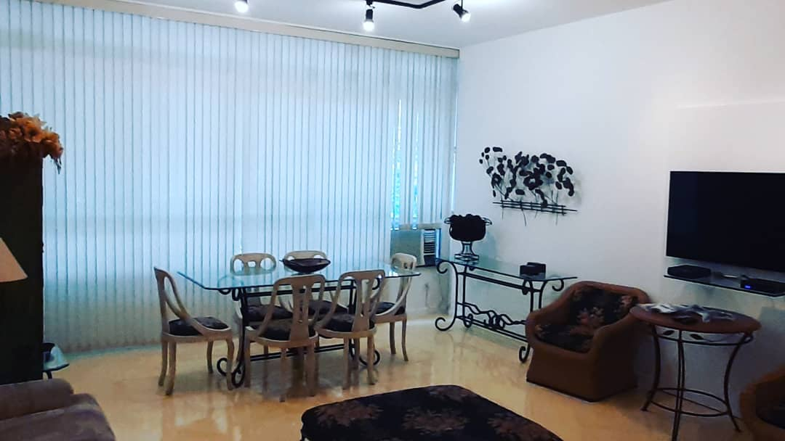

# 🖼️ Carrossel da Seção "Sobre" - PH2Designer

## ✨ **Funcionalidades Implementadas:**

### 🎯 **Carrossel de Imagens**
- **Navegação por botões**: Setas esquerda/direita
- **Indicadores visuais**: Pontos (dots) para navegação direta
- **Transições suaves**: Animação de 0.5s entre slides
- **Responsivo**: Adapta-se a diferentes tamanhos de tela

### 🎨 **Design**
- **Bordas arredondadas**: 12px de raio
- **Sombra elegante**: Efeito de profundidade
- **Botões estilizados**: Fundo semi-transparente com hover
- **Dots dourados**: Cor #FFD700 (gold) para manter a identidade visual

## 📁 **Como Adicionar Mais Fotos:**

### 1️⃣ **Adicione as imagens na pasta `assets/`**
```bash
# Exemplo de nomes sugeridos:
assets/sobre2.jpg
assets/sobre3.jpg
assets/sobre4.jpg
```

### 2️⃣ **Edite o arquivo `index.html`**
Localize a seção "Sobre" (linha ~60) e adicione novos slides:

```html
<div class="sobre-carousel-track">
  <div class="sobre-carousel-slide">
    
  </div>
  
  <!-- NOVO SLIDE - Descomente e ajuste -->
  <div class="sobre-carousel-slide">
    
  </div>
  
  <!-- NOVO SLIDE - Descomente e ajuste -->
  <div class="sobre-carousel-slide">
    
  </div>
</div>
```

### 3️⃣ **Adicione os dots correspondentes**
```html
<div class="sobre-carousel-dots">
  <span class="sobre-dot active" onclick="currentSobreSlide(1)"></span>
  
  <!-- NOVO DOT - Descomente e ajuste -->
  <span class="sobre-dot" onclick="currentSobreSlide(2)"></span>
  
  <!-- NOVO DOT - Descomente e ajuste -->
  <span class="sobre-dot" onclick="currentSobreSlide(3)"></span>
</div>
```

## 🎯 **Exemplo Completo com 3 Fotos:**

```html
<div class="sobre-carousel">
  <div class="sobre-carousel-container">
    <div class="sobre-carousel-track">
      <div class="sobre-carousel-slide">
        
      </div>
      <div class="sobre-carousel-slide">
        
      </div>
      <div class="sobre-carousel-slide">
        
      </div>
    </div>
  </div>
  <button class="sobre-carousel-btn prev" onclick="moveSobreSlide(-1)">
    <i class="fas fa-chevron-left"></i>
  </button>
  <button class="sobre-carousel-btn next" onclick="moveSobreSlide(1)">
    <i class="fas fa-chevron-right"></i>
  </button>
  <div class="sobre-carousel-dots">
    <span class="sobre-dot active" onclick="currentSobreSlide(1)"></span>
    <span class="sobre-dot" onclick="currentSobreSlide(2)"></span>
    <span class="sobre-dot" onclick="currentSobreSlide(3)"></span>
  </div>
</div>
```

## 📱 **Responsividade:**

### **Desktop (>768px):**
- Botões: 40x40px
- Posição: 10px das bordas

### **Tablet (≤768px):**
- Botões: 35x35px
- Posição: 8px das bordas

### **Mobile (≤480px):**
- Botões: 30x30px
- Posição: 5px das bordas

## 🎨 **Personalização:**

### **Cores dos Dots:**
- **Inativo**: `rgba(255, 215, 0, 0.3)` (dourado transparente)
- **Ativo**: `#FFD700` (dourado sólido)
- **Hover**: `rgba(255, 215, 0, 0.6)` (dourado semi-transparente)

### **Transições:**
- **Duração**: 0.5s
- **Easing**: ease-in-out
- **Hover dos botões**: 0.3s

## 🚀 **JavaScript Automático:**

O carrossel funciona automaticamente! O JavaScript:
- ✅ Detecta o número de slides
- ✅ Atualiza os dots automaticamente
- ✅ Gerencia a navegação circular
- ✅ Funciona com qualquer número de fotos

---

**💡 Dica**: Mantenha as imagens com proporções similares para melhor visualização! 